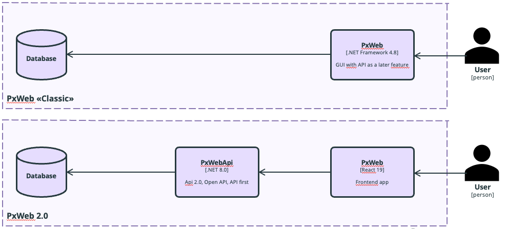

# Overview

To set up the PxTools ecosystem, you must first install and configure PxWebApi 2.0. This API acts as the backend service for data access and management. Once PxWebApi 2.0 is running and properly configured, you can proceed to install PxWeb 2.0. During the configuration of PxWeb 2.0, you need to connect it to your PxWebApi instance and make any additional customizations required for your environment.

The installation and configuration steps for both PxWebApi and PxWeb are described in detail in their respective documentation sections.

## PxWeb «Classic» vs 2.0

## Releases

- [PxWeb 2.0](https://github.com/PxTools/PxWeb2/releases)
- [PxWebApi 2.0](https://github.com/PxTools/PxWebApi/releases)
- [PxWeb "Classic"](https://github.com/statisticssweden/PxWeb/releases)
